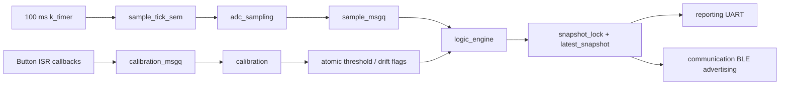

# Design Challenge 1 报告草稿：高可靠温度监测与控制器

> 使用说明：本文件是基于当前 `design-challenge-1` 代码与已有串口日志整理的报告草稿/素材。作业说明限制 AI 只能用于有限语言辅助，因此提交前应由小组成员逐句核对、加入自己的实验截图/日志，并改写为自己的最终表达。英文版 `report_dc1_EN.md` 与本文同步维护；后续修改请两边同时更新。

## 1. RTOS 架构与线程划分

本设计在 nRF54L15 DK 上实现了一个基于 Zephyr RTOS 的 LM335 温度监测系统。LM335 的 `V+` 同时作为模拟输出连接到 `P1.11 / AIN4`，并通过 `330 ohm` 电阻连接到 `VDD 3.3 V`；`GND` 接开发板地，`ADJ` 悬空。ADC 配置位于 `boards/nrf54l15dk_nrf54l15_cpuapp.overlay`，使用 SAADC `AIN4`、14-bit 分辨率、内部参考和 `ADC_GAIN_1_4`。

系统使用五个线程，其中四个对应任务要求，另加一个校准线程。优先级数值越小表示优先级越高：

| 线程 | 优先级 | 周期/触发 | 职责 |
|---|---:|---|---|
| `adc_sampling` | 0 | `k_timer` 每 100 ms 释放 `sample_tick_sem` | 读取 ADC、转换为 mV 和摄氏温度、检查合法范围、把样本写入消息队列 |
| `logic_engine` | 1 | 等待 `sample_msgq` | 计算 1 分钟平均、执行 NORMAL/WARNING/FAULT/DRIFT 状态机、驱动 LED |
| `calibration` | 2 | 等待 `calibration_msgq` | 响应 SW0-SW3，安全更新阈值、重置或切换漂移检测模式 |
| `reporting` | 3 | 每 1 s | 通过 UART 输出结构化状态日志 |
| `communication` | 3 | 每 1 s | 更新 BLE Manufacturer Specific Data，FAULT 时停止广播 |

采样路径被设计为最高优先级并由内核定时器触发，而不是由串口打印或 BLE 更新驱动。`sample_timer_handler()` 只执行 `k_sem_give()`，因此定时器中断路径很短；实际 ADC 读取在 `adc_sampling` 线程中完成。该线程优先级高于逻辑、校准、报告和通信线程，可减少 100 ms 采样被低优先级工作阻塞的风险。串口打印和 BLE 更新均在优先级 3 线程中执行，不直接参与采样闭环。

线程间通信采用 Zephyr 内核对象，而不是裸全局变量轮询。ADC 线程把 `struct sensor_sample` 写入 `sample_msgq`，逻辑线程按 FIFO 消费样本。按钮中断回调不直接修改阈值，而是把命令写入 `calibration_msgq`，再由校准线程处理。系统最新状态被打包为 `struct system_snapshot`，由 `snapshot_lock` mutex 保护；报告线程和 BLE 线程只复制快照后再释放锁，避免长时间占用共享资源。阈值、错误计数和模式标志使用 `atomic_t`，例如 `warning_threshold_centi`、`adc_error_count`、`queue_overrun_count` 和 `drift_reset_requested`，使轻量状态更新不需要持有全局 mutex。

IPC 关系如下：



状态机是确定性的：无效样本立即进入 `FAULT`，LED 常亮；有效样本下，如果漂移基线已建立且漂移激活，则进入 `DRIFT`；否则当 1 分钟平均温度高于阈值时进入 `WARNING`；剩余情况为 `NORMAL`。LED 映射也固定：`NORMAL=OFF`，`WARNING/DRIFT=50 ms blink`，`FAULT=SOLID`。BLE 载荷包含 big-endian 的 `int16` 平均温度和 `uint8` 状态字节，FAULT 时调用 `bt_le_adv_stop()` 停止广播。

## 2. 计算效率与内存占用

LM335 的转换没有使用浮点采样数组。ADC 读数先转换为毫伏，然后用整数计算摄氏百分之一度：

```c
sample->temp_centi = (int16_t)(mv * 10 - 27315);
```

这来自 LM335 的 10 mV/K 输出特性：`mv * 10` 得到 centi-K，再减去 `273.15 K` 对应的 `27315` centi-degree。串口打印时才格式化为 `xx.yy C`。这种表示避免了连续采样路径中的浮点数组和浮点平均。

1 分钟平均窗口对应 600 个 100 ms 样本。实现使用 `int16_t temperature_window[600]` 和一个 `int32_t window_sum` 构成环形缓冲区：每次新样本到达时减去被覆盖的旧值、加上新值，再用 `window_sum / window_count` 得到平均值。该温度窗口占用约 `600 * 2 = 1200 bytes`。如果直接存储 600 个 `float`，至少需要 2400 bytes；如果存储 600 个 `double`，则需要 4800 bytes。当前实现比 float 队列节省约 50%，同时支持真正的滑动 1 分钟窗口。

漂移检测使用 Welford 在线算法。每个 `welford_stats` 只保存 `count`、`mean_q16` 和 `m2_q16`，用 Q16 定点数维护均值和方差，不保存 24 小时原始样本。系统每分钟先用 Welford 计算这一分钟的平均值和方差；只有当本分钟 600 个样本全部有效且方差不超过 `DRIFT_CONTROLLED_VARIANCE_CENTI2 = 900` 时，才把该分钟视为受控环境。真实模式要求 1440 个受控分钟建立 24 小时基线；demo 模式要求 3 个受控分钟，便于实验演示。基线建立后，若当前分钟平均值与基线差值达到 `2.00 C`，置位 `DRIFT`；当差值降到 `1.50 C` 以下时清除，形成滞回，避免边界抖动。

构建输出可用于说明资源占用。当前 ELF 的 `arm-zephyr-eabi-size` 结果为：

| 项目 | 字节 |
|---|---:|
| `text` | 130192 |
| `data` | 4012 |
| `bss` | 33345 |
| 合计 | 167549 |

应用显式线程栈合计为 `1536 + 2560 + 2048 + 2048 + 1536 = 9728 bytes`。按符号表，`temperature_window` 为 0x4b0，即 1200 bytes；`logic_thread_stack` 为 2560 bytes，是最大的应用线程栈。整体 RAM 占用中还包含 Zephyr、Bluetooth、logging 和中断栈等系统开销。设计上的关键点是：长期漂移检测没有引入 24 小时原始数组，1 分钟平均也没有存储 float 历史。

## 3. 实时校准与并发安全

实时校准通过开发板按钮完成。`SW0` 每次将告警阈值降低 `0.50 C`，`SW1` 将阈值升高 `0.50 C`，`SW2` 把阈值恢复到 `28.00 C` 并请求重置漂移跟踪，`SW3` 在 24h 漂移模式和 demo 模式之间切换。阈值被限制在 `15.00 C` 到 `45.00 C`，避免用户输入导致明显无意义的状态。

按钮回调只把命令放入 `calibration_msgq`，不在中断上下文中执行打印、复杂计算或共享状态更新。校准线程从队列中取出命令后使用 `atomic_set()` 更新 `warning_threshold_centi`。逻辑线程在每次处理样本时使用 `atomic_get()` 读取阈值，因此如果校准发生在平均计算过程中，逻辑线程要么使用旧阈值完成当前一次状态判定，要么在下一次样本处理时使用新阈值，不会读到部分更新值。

漂移模式切换和重置也使用 atomic 标志完成。校准线程设置 `drift_reset_requested`，逻辑线程在自己的上下文中通过 `atomic_cas()` 消费该请求并调用 `reset_drift_tracking()`。这避免了校准线程直接修改 `minute_stats`、`drift_baseline_builder`、`drift_controlled_minutes` 等逻辑线程拥有的数据结构，从而保持单写者模型。共享快照的更新则通过 mutex 一次性复制完整结构，报告线程和 BLE 线程不会观察到半更新状态。

这种设计把高频采样、状态计算、用户校准、串口输出和 BLE 通信解耦。即使用户连续按键，校准命令只进入小型消息队列；若队列溢出，`queue_overrun_count` 会增加并在日志中暴露。采样线程仍由 `sample_tick_sem` 驱动，不需要等待按钮处理、串口输出或 BLE 栈操作。

## 4. 系统测试与证据

新的串口日志位于 `design-challenge-1/logs/`。`log1.txt` 记录实时阈值校准和 WARNING 转换，`log2.txt` 记录 demo 漂移检测，`log3.txt` 记录传感器断开故障，`log4.txt` 记录软件采样抖动统计。四个日志中的状态行均保持 1 秒报告节奏，且正常、校准、漂移、故障和抖动测试期间 `Q_OVR` 均为 0，说明低优先级报告路径没有造成可见消息队列积压。抖动测试没有打印每个 100 ms 样本，而是每 600 个采样间隔输出一次摘要，避免串口输出本身影响采样时序。

`log1.txt` 显示校准线程可以在采样继续运行时更新阈值。系统在 `[69002 ms]` 仍使用默认 `28.00 C` 阈值并处于 NORMAL；随后连续按下 SW0，串口输出 `Calibration: threshold -> ...`，报告行中的 `Thr` 随之更新。当阈值降到 `22.00 C`，当前 1 分钟平均值 `22.32 C` 高于阈值，系统确定性进入 WARNING，LED 显示为 BLINKING：

```text
[69002 ms] Avg: 22.30 C | Raw: 22.15 C | MV: 2953 | Thr: 28.00 C | Mode: NORMAL | LED: OFF | ... | ADC_ERR: 0 | Q_OVR: 0
Calibration: threshold -> 27.50 C
[70002 ms] Avg: 22.30 C | Raw: 22.45 C | MV: 2956 | Thr: 27.50 C | Mode: NORMAL | LED: OFF | ... | ADC_ERR: 0 | Q_OVR: 0
Calibration: threshold -> 22.00 C
[88002 ms] Avg: 22.32 C | Raw: 22.45 C | MV: 2956 | Thr: 22.00 C | Mode: WARNING | LED: BLINKING | ... | ADC_ERR: 0 | Q_OVR: 0
```

`log2.txt` 显示了漂移检测扩展功能。按下 SW3 后系统进入 demo 模式，并在 3 个受控分钟后锁定 `21.96 C` 漂移基线：

```text
Drift mode -> demo (3 controlled minute(s) required)
[199002 ms] Avg: 21.92 C | Raw: 22.15 C | MV: 2953 | Thr: 28.00 C | Mode: NORMAL | LED: OFF | DriftRef: D:*0.00 C | LastMin: 22.01 C | Ctrl: 2/3 | Env: CTRL | ADC_ERR: 0 | Q_OVR: 0
Drift baseline locked at 21.96 C after 3 controlled minute(s) [demo]
[201002 ms] Avg: 21.93 C | Raw: 22.15 C | MV: 2953 | Thr: 28.00 C | Mode: NORMAL | LED: OFF | DriftRef: D:21.96 C | LastMin: 21.93 C | Ctrl: 3/3 | Env: CTRL | ADC_ERR: 0 | Q_OVR: 0
```

基线建立后，加热 LM335 使分钟平均值相对基线偏移超过 2.0 C。日志中 `[321002 ms]` 的上一分钟平均值为 `28.51 C`，远高于 `21.96 C` 基线，随后系统进入 DRIFT 并保持 LED 闪烁。温度恢复后，`[681002 ms]` 起系统回到 NORMAL，体现了 1.50 C 清除阈值带来的滞回：

```text
[321002 ms] Avg: 28.52 C | Raw: 29.15 C | MV: 3023 | Thr: 28.00 C | Mode: WARNING | LED: BLINKING | DriftRef: D:21.96 C | LastMin: 28.51 C | Ctrl: 3/3 | Env: TRANS | ADC_ERR: 0 | Q_OVR: 0
[605002 ms] Avg: 23.73 C | Raw: 23.55 C | MV: 2967 | Thr: 28.00 C | Mode: DRIFT | LED: BLINKING | DriftRef: D:21.96 C | LastMin: 24.78 C | Ctrl: 3/3 | Env: TRANS | ADC_ERR: 0 | Q_OVR: 0
[681002 ms] Avg: 23.00 C | Raw: 22.45 C | MV: 2956 | Thr: 28.00 C | Mode: NORMAL | LED: OFF | DriftRef: D:21.96 C | LastMin: 23.01 C | Ctrl: 3/3 | Env: CTRL | ADC_ERR: 0 | Q_OVR: 0
```

`log3.txt` 显示，在断开 LM335 输出线或地线后，ADC 读数上升到约 `3.33 V`，超过 `SENSOR_MAX_VALID_MV = 3300`，系统进入 FAULT：

```text
[27002 ms] Avg: 22.31 C | Raw: 22.15 C | MV: 2953 | Thr: 28.00 C | Mode: NORMAL | LED: OFF | ... | ADC_ERR: 0 | Q_OVR: 0
[28002 ms] Avg: --.- C | Raw: 3.332 V | MV: 3332 | Thr: 28.00 C | Mode: FAULT | LED: SOLID | DriftRef: LEARN | Ctrl: 0/1440 | ADC_ERR: 4 | Q_OVR: 0
[35002 ms] Avg: --.- C | Raw: 3.332 V | MV: 3332 | Thr: 28.00 C | Mode: FAULT | LED: SOLID | DriftRef: LEARN | Ctrl: 0/1440 | ADC_ERR: 74 | Q_OVR: 0
```

在 FAULT 期间，`ADC_ERR` 每秒约增加 10，符合 100 ms 采样周期下每秒 10 次无效样本的预期。传感器恢复后，日志在 `[36002 ms]` 回到 NORMAL，平均温度恢复显示，同时 `ADC_ERR` 保留累计值用于诊断：

```text
[36002 ms] Avg: 22.31 C | Raw: 22.15 C | MV: 2953 | Thr: 28.00 C | Mode: NORMAL | LED: OFF | ... | ADC_ERR: 78 | Q_OVR: 0
```

`log4.txt` 验证了 100 ms 采样周期的软件抖动。每个 `JITTER` 摘要覆盖 600 个相邻采样间隔，约等于 60 秒运行时间。从 `[60002 ms]` 到 `[480002 ms]`，日志共记录 8 个完整摘要窗口；每个窗口均为 `min=100 ms`、`max=100 ms`、`avg=100.00 ms`、`bad=0`，容差设置为 +/- 2 ms。因此，在约 4800 个采样间隔内，没有观察到超过容差的采样延迟：

```text
[60002 ms] Avg: 22.16 C | Raw: 22.15 C | MV: 2953 | Thr: 28.00 C | Mode: NORMAL | LED: OFF | ... | Ctrl: 1/1440 | Env: CTRL | ADC_ERR: 0 | Q_OVR: 0
JITTER: n=600 | min=100 ms | max=100 ms | avg=100.00 ms | bad=0 | tolerance=+/- 2 ms
...
[480002 ms] Avg: 22.12 C | Raw: 22.15 C | MV: 2953 | Thr: 28.00 C | Mode: NORMAL | LED: OFF | ... | Ctrl: 8/1440 | Env: CTRL | ADC_ERR: 0 | Q_OVR: 0
JITTER: n=600 | min=100 ms | max=100 ms | avg=100.00 ms | bad=0 | tolerance=+/- 2 ms
```

nRF Connect 手机截图验证了 BLE 广播载荷。重新命名后的设备显示为 `Group15Thermal`。NORMAL 截图中的 Manufacturer Data 为 `0x0059 0x08A400`，其中 `0x0059` 是 Nordic Company ID，`0x08A4` 按 big-endian 解析为 `2212`，即 `22.12 C`，最后一个字节 `0x00` 表示 NORMAL。WARNING 截图中的 Manufacturer Data 为 `0x0059 0x089E01`，其中 `0x089E` 为 `22.06 C`，最后一个字节 `0x01` 表示 WARNING。由于 DRIFT 和 FAULT 的 BLE 截图没有单独采集，本报告只把 BLE 证据声明为覆盖 NORMAL 和 WARNING；DRIFT 与 FAULT 的功能行为由 `log2.txt` 和 `log3.txt` 的串口日志证明。

当前证据矩阵如下：

| 测试 | 需要的证据 | 当前状态 |
|---|---|---|
| NORMAL 稳态 | 约 1 分钟串口日志，`ADC_ERR=0`、`Q_OVR=0` | 已有，见 `log1.txt` 和 `log2.txt` |
| WARNING | 用 SW0 把阈值降到室温以下，显示 `Mode: WARNING`、LED `BLINKING` | 已有，见 `log1.txt` |
| Live calibration | `Calibration: threshold -> ...`，阈值变化期间采样继续 | 已有，见 `log1.txt` |
| DRIFT demo | `Drift mode -> demo`、`Drift baseline locked`、偏移超过 2 C 后 `Mode: DRIFT` | 已有，见 `log2.txt` |
| FAULT | 断开 LM335 GND 或输出线，显示 `Mode: FAULT`、LED 常亮、`ADC_ERR` 增加 | 已有，见 `log3.txt` |
| 100 ms jitter | 每样本 timestamp 差值统计或 GPIO/逻辑分析仪截图 | 已有软件统计，见 `log4.txt` |
| BLE payload | nRF Connect 中的设备名和 Manufacturer Data | 已有 NORMAL/WARNING 截图；DRIFT/FAULT BLE 行为未单独测试 |

100 ms 抖动测试采用软件统计法完成。代码在 `adc_thread_entry()` 被信号量唤醒后读取 `k_uptime_get()`，记录相邻采样唤醒时间的差值，并统计最小值、最大值、平均值和超过 +/- 2 ms 容差的次数。系统每 600 个间隔打印一次摘要，而不是打印每个样本，从而避免串口输出成为抖动来源。若需要更强的外部验证，也可以在定时器回调或 ADC 采样开始时翻转 GPIO，并用逻辑分析仪测量周期，但当前 `log4.txt` 已提供软件层面的 100 ms 周期证据。

总体而言，当前实现满足核心功能：ADC 采样与串口/BLE 解耦，状态机覆盖 NORMAL、WARNING、FAULT 和扩展 DRIFT，故障通过电压范围检测进入安全状态，校准通过消息队列与 atomic 变量实现线程安全更新，长期漂移检测采用 Welford 算法避免大数组，并且软件抖动日志显示 100 ms 采样周期稳定。实验材料已覆盖串口状态机、校准、故障、漂移、抖动以及 NORMAL/WARNING 的 BLE 广播；如果需要进一步增强证据，可额外补采 DRIFT 或 FAULT 场景下的 BLE 截图。
