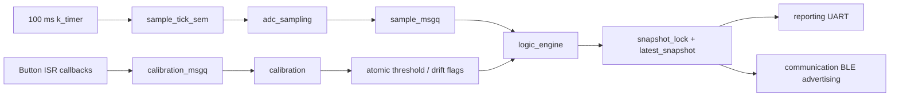

# Design Challenge 1 Report Draft: High-Reliability Thermal Monitor and Controller

> Usage note: this file is a report draft/evidence pack derived from the current `design-challenge-1` code and the available UART log. The coursework brief limits AI use to light language support, so the group should verify every statement, add its own experimental captures, and rewrite the final submission in its own words. The Chinese version `report_dc1_CN.md` is maintained in parallel with this file; update both versions together.

## 1. RTOS Architecture and Threading

The system implements an LM335 thermal monitor on the nRF54L15 DK using Zephyr RTOS. The LM335 `V+` pin is both the analogue output and the ADC input, connected to `P1.11 / AIN4`, and is biased to `VDD 3.3 V` through a `330 ohm` resistor. The LM335 `GND` pin is connected to board ground and `ADJ` is left unconnected. The ADC configuration in `boards/nrf54l15dk_nrf54l15_cpuapp.overlay` selects SAADC `AIN4`, 14-bit resolution, internal reference and `ADC_GAIN_1_4`.

The application uses five threads: the four required responsibility areas plus a dedicated calibration thread. Lower numeric priority means higher scheduling priority:

| Thread | Priority | Period / trigger | Responsibility |
|---|---:|---|---|
| `adc_sampling` | 0 | `k_timer` releases `sample_tick_sem` every 100 ms | Read ADC, convert to mV and centi-degrees C, validate voltage range, publish samples |
| `logic_engine` | 1 | Waits on `sample_msgq` | Compute 1-minute average, run NORMAL/WARNING/FAULT/DRIFT state machine, drive LED |
| `calibration` | 2 | Waits on `calibration_msgq` | Process SW0-SW3, safely update threshold, reset or switch drift mode |
| `reporting` | 3 | Every 1 s | Print structured UART status logs |
| `communication` | 3 | Every 1 s | Update BLE Manufacturer Specific Data and stop advertising in FAULT |

The sampling path has the highest application priority and is triggered by a kernel timer rather than by serial or BLE work. `sample_timer_handler()` only performs `k_sem_give()`, so the timer callback is short; the actual ADC conversion runs in the `adc_sampling` thread. This thread has higher priority than the logic, calibration, reporting and communication threads, reducing the risk that slow UART output or BLE stack activity delays the 100 ms sample schedule. UART and BLE both run at priority 3 and are outside the acquisition loop.

Inter-thread communication uses Zephyr kernel objects instead of unprotected global polling. The ADC thread writes each `struct sensor_sample` to `sample_msgq`, and the logic thread consumes samples in FIFO order. Button interrupt callbacks do not update the threshold directly; they enqueue commands into `calibration_msgq`, which are handled by the calibration thread. The latest system state is copied into a `struct system_snapshot` protected by `snapshot_lock`; the reporting and BLE threads copy the snapshot and then release the mutex before formatting output or updating advertisements. Lightweight shared values such as `warning_threshold_centi`, `adc_error_count`, `queue_overrun_count` and `drift_reset_requested` use `atomic_t`, avoiding a coarse global mutex for simple state updates.

The IPC structure is:



The state machine is deterministic. An invalid sample immediately selects `FAULT` and forces a solid LED. For valid samples, if the drift baseline is ready and drift is active, the state is `DRIFT`; otherwise a 1-minute average above the threshold selects `WARNING`; all remaining valid cases are `NORMAL`. LED behaviour is fixed: `NORMAL=OFF`, `WARNING/DRIFT=50 ms blink`, and `FAULT=SOLID`. The BLE payload contains a big-endian `int16` average temperature and a `uint8` state byte; in FAULT, the communication thread calls `bt_le_adv_stop()`.

## 2. Computational Efficiency and Memory Footprint

The LM335 conversion avoids a floating-point history. The ADC reading is converted to millivolts and then to centi-degrees Celsius using integer arithmetic:

```c
sample->temp_centi = (int16_t)(mv * 10 - 27315);
```

This follows the LM335 scale factor of 10 mV/K: `mv * 10` gives centi-Kelvin, and `27315` centi-degrees converts Kelvin to Celsius. Formatting into `xx.yy C` is only done for printing. The acquisition and averaging path therefore avoids arrays of `float`.

The 1-minute average contains 600 samples at 100 ms spacing. The implementation uses `int16_t temperature_window[600]` with an `int32_t window_sum` as a circular buffer. Each new valid sample subtracts the overwritten value, adds the new value, and computes `window_sum / window_count`. This window uses about `600 * 2 = 1200 bytes`. A 600-entry `float` history would use at least 2400 bytes, and a `double` history would use 4800 bytes. The chosen representation saves about 50% compared with float while still providing a true sliding 1-minute window.

Drift detection uses Welford's online algorithm. Each `welford_stats` object stores only `count`, `mean_q16` and `m2_q16`, using Q16 fixed-point mean and variance rather than storing long-term raw data. The system first computes each minute's mean and variance; a minute is accepted as a controlled-environment sample only if all 600 samples are valid and the variance is no greater than `DRIFT_CONTROLLED_VARIANCE_CENTI2 = 900`. The real mode requires 1440 controlled minutes to establish a 24-hour baseline, while the demo mode requires 3 controlled minutes for practical testing. Once the baseline is ready, a minute average that differs from the baseline by at least `2.00 C` asserts `DRIFT`; the state clears below `1.50 C`, adding hysteresis to avoid boundary noise.

The current build provides the following `arm-zephyr-eabi-size` footprint:

| Item | Bytes |
|---|---:|
| `text` | 130192 |
| `data` | 4012 |
| `bss` | 33345 |
| Total | 167549 |

The explicitly allocated application thread stacks total `1536 + 2560 + 2048 + 2048 + 1536 = 9728 bytes`. From the symbol table, `temperature_window` is 0x4b0, or 1200 bytes, and `logic_thread_stack` is 2560 bytes, the largest application thread stack. The total RAM footprint also includes Zephyr, Bluetooth, logging and interrupt stack overheads. The main design point is that long-term drift detection does not allocate a 24-hour sample array, and the 1-minute average does not keep a floating-point history.

## 3. Live Calibration and Safety

Live calibration is implemented using board buttons. `SW0` lowers the warning threshold by `0.50 C`, `SW1` raises it by `0.50 C`, `SW2` resets it to `28.00 C` and requests a drift-tracking reset, and `SW3` toggles between 24h drift mode and demo mode. The threshold is clamped between `15.00 C` and `45.00 C`, preventing user input from driving the state machine into an obviously invalid configuration.

The button callbacks only enqueue commands into `calibration_msgq`; they do not print, run complex calculations, or mutate shared algorithm state in interrupt context. The calibration thread receives commands and updates `warning_threshold_centi` with `atomic_set()`. The logic thread reads the threshold with `atomic_get()` once per processed sample, so if a calibration event occurs during an average calculation, the logic thread either completes the current decision using the previous threshold or uses the new value on the next sample. It never observes a partially updated threshold.

Drift mode switching and reset requests are handled through atomic flags as well. The calibration thread sets `drift_reset_requested`; the logic thread consumes this request using `atomic_cas()` and then calls `reset_drift_tracking()` in its own context. This prevents the calibration thread from directly modifying `minute_stats`, `drift_baseline_builder`, `drift_controlled_minutes` and other logic-owned structures. In effect, the drift estimator has a single writer. Snapshot publication is protected by a mutex and copied as one complete structure, so reporting and BLE readers do not see a half-updated state.

This design separates high-rate sampling, state processing, user calibration, UART output and BLE communication. Even if the user presses buttons repeatedly, calibration commands only enter a bounded queue. If a queue overrun occurs, `queue_overrun_count` is incremented and exposed in the UART log. The sampling thread remains driven by `sample_tick_sem` and does not wait for button handling, serial formatting or BLE operations.

## 4. Systematic Testing and Evidence

The new UART captures are stored in `design-challenge-1/logs/`. `log1.txt` records live threshold calibration and the WARNING transition, `log2.txt` records demo drift detection, `log3.txt` records sensor-disconnect fault handling, and `log4.txt` records software sampling-jitter statistics. Across the normal, calibration, drift, fault and jitter tests, the status lines keep a 1-second reporting cadence and `Q_OVR` remains 0, indicating that the lower-priority reporting path did not create visible message-queue backlog. The jitter test does not print every 100 ms sample. Instead, it prints one summary every 600 sampling intervals, avoiding the serial output itself becoming the source of timing disturbance.

`log1.txt` shows that the calibration thread updates the threshold while acquisition continues. At `[69002 ms]`, the system is still using the default `28.00 C` threshold and remains in NORMAL. After repeated SW0 presses, the serial console prints `Calibration: threshold -> ...`, and the reported `Thr` value follows the new threshold. When the threshold reaches `22.00 C`, the 1-minute average of `22.32 C` exceeds the threshold, so the system enters WARNING and the LED state becomes BLINKING:

```text
[69002 ms] Avg: 22.30 C | Raw: 22.15 C | MV: 2953 | Thr: 28.00 C | Mode: NORMAL | LED: OFF | ... | ADC_ERR: 0 | Q_OVR: 0
Calibration: threshold -> 27.50 C
[70002 ms] Avg: 22.30 C | Raw: 22.45 C | MV: 2956 | Thr: 27.50 C | Mode: NORMAL | LED: OFF | ... | ADC_ERR: 0 | Q_OVR: 0
Calibration: threshold -> 22.00 C
[88002 ms] Avg: 22.32 C | Raw: 22.45 C | MV: 2956 | Thr: 22.00 C | Mode: WARNING | LED: BLINKING | ... | ADC_ERR: 0 | Q_OVR: 0
```

`log2.txt` demonstrates the drift-detection extension. After SW3 is pressed, the system enters demo mode and locks a `21.96 C` drift baseline after 3 controlled minutes:

```text
Drift mode -> demo (3 controlled minute(s) required)
[199002 ms] Avg: 21.92 C | Raw: 22.15 C | MV: 2953 | Thr: 28.00 C | Mode: NORMAL | LED: OFF | DriftRef: D:*0.00 C | LastMin: 22.01 C | Ctrl: 2/3 | Env: CTRL | ADC_ERR: 0 | Q_OVR: 0
Drift baseline locked at 21.96 C after 3 controlled minute(s) [demo]
[201002 ms] Avg: 21.93 C | Raw: 22.15 C | MV: 2953 | Thr: 28.00 C | Mode: NORMAL | LED: OFF | DriftRef: D:21.96 C | LastMin: 21.93 C | Ctrl: 3/3 | Env: CTRL | ADC_ERR: 0 | Q_OVR: 0
```

After the baseline is established, heating the LM335 moves the minute average more than 2.0 C from the baseline. At `[321002 ms]`, the previous minute average is `28.51 C`, well above the `21.96 C` baseline. The system then enters DRIFT and keeps the LED blinking. When the temperature returns close to baseline, the system returns to NORMAL from `[681002 ms]`, showing the effect of the 1.50 C clear threshold:

```text
[321002 ms] Avg: 28.52 C | Raw: 29.15 C | MV: 3023 | Thr: 28.00 C | Mode: WARNING | LED: BLINKING | DriftRef: D:21.96 C | LastMin: 28.51 C | Ctrl: 3/3 | Env: TRANS | ADC_ERR: 0 | Q_OVR: 0
[605002 ms] Avg: 23.73 C | Raw: 23.55 C | MV: 2967 | Thr: 28.00 C | Mode: DRIFT | LED: BLINKING | DriftRef: D:21.96 C | LastMin: 24.78 C | Ctrl: 3/3 | Env: TRANS | ADC_ERR: 0 | Q_OVR: 0
[681002 ms] Avg: 23.00 C | Raw: 22.45 C | MV: 2956 | Thr: 28.00 C | Mode: NORMAL | LED: OFF | DriftRef: D:21.96 C | LastMin: 23.01 C | Ctrl: 3/3 | Env: CTRL | ADC_ERR: 0 | Q_OVR: 0
```

`log3.txt` shows that disconnecting the LM335 output or ground causes the ADC reading to rise to about `3.33 V`, above `SENSOR_MAX_VALID_MV = 3300`, and the system enters FAULT:

```text
[27002 ms] Avg: 22.31 C | Raw: 22.15 C | MV: 2953 | Thr: 28.00 C | Mode: NORMAL | LED: OFF | ... | ADC_ERR: 0 | Q_OVR: 0
[28002 ms] Avg: --.- C | Raw: 3.332 V | MV: 3332 | Thr: 28.00 C | Mode: FAULT | LED: SOLID | DriftRef: LEARN | Ctrl: 0/1440 | ADC_ERR: 4 | Q_OVR: 0
[35002 ms] Avg: --.- C | Raw: 3.332 V | MV: 3332 | Thr: 28.00 C | Mode: FAULT | LED: SOLID | DriftRef: LEARN | Ctrl: 0/1440 | ADC_ERR: 74 | Q_OVR: 0
```

During FAULT, `ADC_ERR` increases by roughly 10 per second, matching the expected ten invalid 100 ms samples per second. After the sensor is reconnected, the log returns to NORMAL at `[36002 ms]`; the average temperature is displayed again and the accumulated `ADC_ERR` count remains available for diagnosis:

```text
[36002 ms] Avg: 22.31 C | Raw: 22.15 C | MV: 2953 | Thr: 28.00 C | Mode: NORMAL | LED: OFF | ... | ADC_ERR: 78 | Q_OVR: 0
```

`log4.txt` verifies the 100 ms sampling period using software jitter statistics. Each `JITTER` summary covers 600 consecutive sampling intervals, or approximately 60 seconds of runtime. From `[60002 ms]` to `[480002 ms]`, the log records 8 complete summary windows. Every window reports `min=100 ms`, `max=100 ms`, `avg=100.00 ms` and `bad=0`, with a tolerance of +/- 2 ms. Therefore, over approximately 4800 sampling intervals, no interval outside the configured tolerance was observed:

```text
[60002 ms] Avg: 22.16 C | Raw: 22.15 C | MV: 2953 | Thr: 28.00 C | Mode: NORMAL | LED: OFF | ... | Ctrl: 1/1440 | Env: CTRL | ADC_ERR: 0 | Q_OVR: 0
JITTER: n=600 | min=100 ms | max=100 ms | avg=100.00 ms | bad=0 | tolerance=+/- 2 ms
...
[480002 ms] Avg: 22.12 C | Raw: 22.15 C | MV: 2953 | Thr: 28.00 C | Mode: NORMAL | LED: OFF | ... | Ctrl: 8/1440 | Env: CTRL | ADC_ERR: 0 | Q_OVR: 0
JITTER: n=600 | min=100 ms | max=100 ms | avg=100.00 ms | bad=0 | tolerance=+/- 2 ms
```

nRF Connect phone screenshots verify the BLE advertising payload. After renaming, the device appears as `Group15Thermal`. In the NORMAL screenshot, the Manufacturer Data is `0x0059 0x08A400`: `0x0059` is the Nordic Company ID, `0x08A4` is interpreted as the big-endian value `2212`, or `22.12 C`, and the final byte `0x00` represents NORMAL. In the WARNING screenshot, the Manufacturer Data is `0x0059 0x089E01`: `0x089E` represents `22.06 C`, and the final byte `0x01` represents WARNING. Since separate DRIFT and FAULT BLE screenshots were not captured, this report only claims BLE evidence for NORMAL and WARNING; the DRIFT and FAULT behaviours are evidenced by the UART logs in `log2.txt` and `log3.txt`.

The current evidence matrix is:

| Test | Required evidence | Current status |
|---|---|---|
| NORMAL steady state | Around 1 minute of UART logs with `ADC_ERR=0` and `Q_OVR=0` | Available in `log1.txt` and `log2.txt` |
| WARNING | Use SW0 to lower threshold below room temperature; show `Mode: WARNING` and LED `BLINKING` | Available in `log1.txt` |
| Live calibration | `Calibration: threshold -> ...` while sampling continues | Available in `log1.txt` |
| DRIFT demo | `Drift mode -> demo`, `Drift baseline locked`, then `Mode: DRIFT` after a >2 C offset | Available in `log2.txt` |
| FAULT | Disconnect LM335 GND or output; show `Mode: FAULT`, solid LED and increasing `ADC_ERR` | Available in `log3.txt` |
| 100 ms jitter | Per-sample timestamp deltas or GPIO/logic-analyser capture | Software statistics available in `log4.txt` |
| BLE payload | Device name and Manufacturer Data in nRF Connect | NORMAL/WARNING screenshots available; DRIFT/FAULT BLE behaviour not separately tested |

The 100 ms jitter test is implemented using the software-statistics approach. After `adc_thread_entry()` is released by the semaphore, it reads `k_uptime_get()`, records the delta between consecutive sampling wake-ups, and tracks the minimum, maximum, average and number of intervals outside the +/- 2 ms tolerance. The system prints one summary every 600 intervals rather than printing every sample, so the UART output does not become a timing load. A stronger external check could also toggle a GPIO in the timer callback or immediately before ADC sampling and measure it with a logic analyser, but `log4.txt` already provides software-level evidence for the 100 ms period.

Overall, the implementation satisfies the core design challenge: ADC sampling is decoupled from UART and BLE work, the state machine covers NORMAL, WARNING, FAULT and the extension DRIFT state, faults drive the system into a safe visible LED state, live calibration uses queues and atomic variables for thread-safe updates, long-term drift detection uses Welford's algorithm instead of a large raw-data buffer, and the software jitter log shows a stable 100 ms sampling period. The collected evidence covers the UART state machine, calibration, fault handling, drift detection, sampling jitter, and NORMAL/WARNING BLE advertising. Additional DRIFT or FAULT BLE screenshots could be added if stronger BLE-specific evidence is required.
